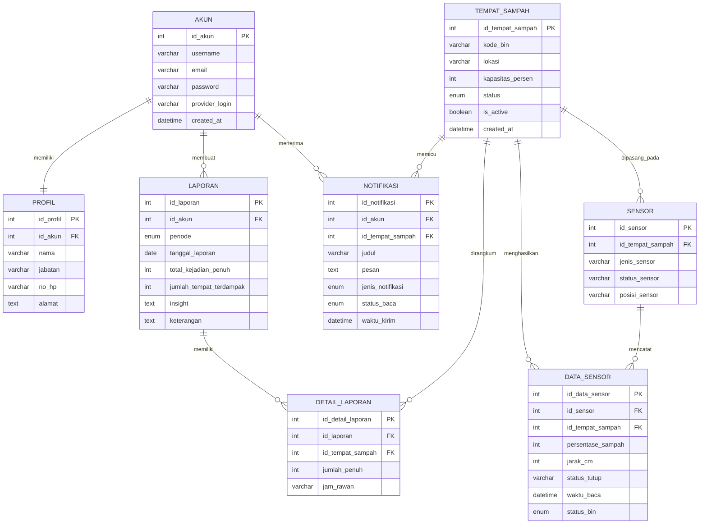
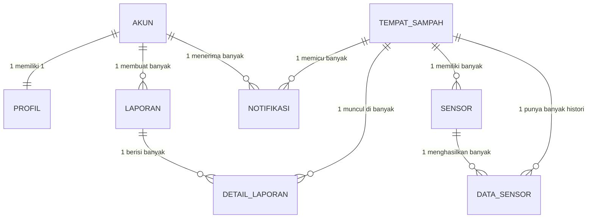

# ERD SAMOSA

## Catatan awal

Project SAMOSA saat ini belum memakai database relasional penuh. Implementasi yang ditemukan di kode masih memakai:

- `SharedPreferences` untuk data tempat sampah lokal dan state notifikasi
- `Firebase Authentication` untuk login
- `Firebase Realtime Database` untuk pembacaan alat IoT asli

Referensi implementasi:

- [TempatSampah.kt](/D:/Android/SAMOSASampahOtomatisAngsau/app/src/main/java/com/example/sdn4angsau/samosa/TempatSampah.kt:9)
- [TempatSampahLocalStore.kt](/D:/Android/SAMOSASampahOtomatisAngsau/app/src/main/java/com/example/sdn4angsau/samosa/TempatSampahLocalStore.kt:11)
- [MainActivity.kt](/D:/Android/SAMOSASampahOtomatisAngsau/app/src/main/java/com/example/sdn4angsau/samosa/MainActivity.kt:35)
- [DashboardActivity.kt](/D:/Android/SAMOSASampahOtomatisAngsau/app/src/main/java/com/example/sdn4angsau/samosa/DashboardActivity.kt:126)
- [LaporanSampahHelper.kt](/D:/Android/SAMOSASampahOtomatisAngsau/app/src/main/java/com/example/sdn4angsau/samosa/LaporanSampahHelper.kt:39)
- [TempatSampahHistoryHelper.kt](/D:/Android/SAMOSASampahOtomatisAngsau/app/src/main/java/com/example/sdn4angsau/samosa/TempatSampahHistoryHelper.kt:63)
- [TempatSampahNotificationHelper.kt](/D:/Android/SAMOSASampahOtomatisAngsau/app/src/main/java/com/example/sdn4angsau/samosa/TempatSampahNotificationHelper.kt:29)

Karena itu, ERD di bawah ini adalah versi relasional yang paling sesuai dengan alur data project kalian dan siap dipakai untuk laporan, implementasi MySQL, atau gambar ERD formal.

## Entitas utama yang sesuai project

1. `akun`
2. `profil`
3. `tempat_sampah`
4. `sensor`
5. `data_sensor`
6. `notifikasi`
7. `laporan`
8. `detail_laporan`

## ERD yang direkomendasikan



## Alasan tabel ini paling cocok dengan project

### 1. `tempat_sampah`

Tabel ini langsung mengikuti model `TempatSampah` yang punya `binId`, `lokasi`, `persentase`, `isActive`, dan status turunan `AMAN/WASPADA/PENUH`.

Sumber:

- [TempatSampah.kt](/D:/Android/SAMOSASampahOtomatisAngsau/app/src/main/java/com/example/sdn4angsau/samosa/TempatSampah.kt:9)

### 2. `sensor`

Project membaca data alat IoT asli dari node Firebase `Tempat_Sampah_1` dengan atribut `status_tutup`, `jarak_cm`, dan `kapasitas_persen`. Karena itu sensor sebaiknya dipisah dari tempat sampah.

Sumber:

- [DashboardActivity.kt](/D:/Android/SAMOSASampahOtomatisAngsau/app/src/main/java/com/example/sdn4angsau/samosa/DashboardActivity.kt:127)

### 3. `data_sensor`

Karena pembacaan sensor terjadi berkali-kali dari waktu ke waktu, maka bentuk relasional yang paling tepat adalah tabel histori pembacaan. Ini menggantikan data realtime mentah menjadi data yang bisa disimpan dan dianalisis.

Sumber:

- [DashboardActivity.kt](/D:/Android/SAMOSASampahOtomatisAngsau/app/src/main/java/com/example/sdn4angsau/samosa/DashboardActivity.kt:133)
- [TempatSampahHistoryHelper.kt](/D:/Android/SAMOSASampahOtomatisAngsau/app/src/main/java/com/example/sdn4angsau/samosa/TempatSampahHistoryHelper.kt:63)

### 4. `notifikasi`

Aplikasi menyimpan state notifikasi per tong dan mengirim pengingat berkala saat tong penuh. Maka notifikasi layak dijadikan tabel sendiri.

Sumber:

- [TempatSampahNotificationHelper.kt](/D:/Android/SAMOSASampahOtomatisAngsau/app/src/main/java/com/example/sdn4angsau/samosa/TempatSampahNotificationHelper.kt:29)

### 5. `laporan` dan `detail_laporan`

Laporan di project bukan hanya milik satu tong, tetapi hasil rekap dari banyak tong aktif. Karena itu lebih rapi jika:

- `laporan` menyimpan header laporan
- `detail_laporan` menyimpan daftar tong yang masuk ke laporan

Ini lebih baik daripada menaruh `id_tempat_sampah` langsung di tabel `laporan`.

Sumber:

- [LaporanSampahHelper.kt](/D:/Android/SAMOSASampahOtomatisAngsau/app/src/main/java/com/example/sdn4angsau/samosa/LaporanSampahHelper.kt:39)
- [LaporanSampahHelper.kt](/D:/Android/SAMOSASampahOtomatisAngsau/app/src/main/java/com/example/sdn4angsau/samosa/LaporanSampahHelper.kt:44)

## Relasi antar tabel

### Relasi utama

1. `akun` 1:1 `profil`
2. `akun` 1:N `laporan`
3. `akun` 1:N `notifikasi`
4. `tempat_sampah` 1:N `sensor`
5. `sensor` 1:N `data_sensor`
6. `tempat_sampah` 1:N `data_sensor`
7. `tempat_sampah` 1:N `notifikasi`
8. `laporan` 1:N `detail_laporan`
9. `tempat_sampah` 1:N `detail_laporan`

### Penjelasan singkat relasi

- Satu akun memiliki satu profil.
- Satu akun bisa membuat banyak laporan.
- Satu akun bisa menerima banyak notifikasi.
- Satu tempat sampah bisa dipasangi satu atau lebih sensor.
- Satu sensor menghasilkan banyak data pembacaan.
- Satu tempat sampah memiliki banyak histori data pembacaan.
- Satu tempat sampah dapat memicu banyak notifikasi.
- Satu laporan berisi banyak detail laporan.
- Satu tempat sampah bisa muncul di banyak laporan.

## Implementasi relasi antar tabel versi SQL

```sql
CREATE TABLE akun (
    id_akun INT AUTO_INCREMENT PRIMARY KEY,
    username VARCHAR(50) NOT NULL UNIQUE,
    email VARCHAR(100),
    password VARCHAR(255),
    provider_login VARCHAR(20) DEFAULT 'local',
    created_at DATETIME DEFAULT CURRENT_TIMESTAMP
);

CREATE TABLE profil (
    id_profil INT AUTO_INCREMENT PRIMARY KEY,
    id_akun INT NOT NULL UNIQUE,
    nama VARCHAR(100),
    jabatan VARCHAR(100),
    no_hp VARCHAR(20),
    alamat TEXT,
    CONSTRAINT fk_profil_akun
        FOREIGN KEY (id_akun) REFERENCES akun(id_akun)
        ON UPDATE CASCADE
        ON DELETE CASCADE
);

CREATE TABLE tempat_sampah (
    id_tempat_sampah INT AUTO_INCREMENT PRIMARY KEY,
    kode_bin VARCHAR(30) NOT NULL UNIQUE,
    lokasi VARCHAR(100) NOT NULL,
    kapasitas_persen INT NOT NULL,
    status ENUM('AMAN','WASPADA','PENUH') NOT NULL,
    is_active BOOLEAN DEFAULT TRUE,
    created_at DATETIME DEFAULT CURRENT_TIMESTAMP
);

CREATE TABLE sensor (
    id_sensor INT AUTO_INCREMENT PRIMARY KEY,
    id_tempat_sampah INT NOT NULL,
    jenis_sensor VARCHAR(50) NOT NULL,
    status_sensor VARCHAR(30) NOT NULL,
    posisi_sensor VARCHAR(50),
    CONSTRAINT fk_sensor_tempat_sampah
        FOREIGN KEY (id_tempat_sampah) REFERENCES tempat_sampah(id_tempat_sampah)
        ON UPDATE CASCADE
        ON DELETE CASCADE
);

CREATE TABLE data_sensor (
    id_data_sensor INT AUTO_INCREMENT PRIMARY KEY,
    id_sensor INT NOT NULL,
    id_tempat_sampah INT NOT NULL,
    persentase_sampah INT NOT NULL,
    jarak_cm INT,
    status_tutup VARCHAR(30),
    waktu_baca DATETIME NOT NULL,
    status_bin ENUM('AMAN','WASPADA','PENUH') NOT NULL,
    CONSTRAINT fk_data_sensor_sensor
        FOREIGN KEY (id_sensor) REFERENCES sensor(id_sensor)
        ON UPDATE CASCADE
        ON DELETE CASCADE,
    CONSTRAINT fk_data_sensor_tempat_sampah
        FOREIGN KEY (id_tempat_sampah) REFERENCES tempat_sampah(id_tempat_sampah)
        ON UPDATE CASCADE
        ON DELETE CASCADE
);

CREATE TABLE notifikasi (
    id_notifikasi INT AUTO_INCREMENT PRIMARY KEY,
    id_akun INT NOT NULL,
    id_tempat_sampah INT NOT NULL,
    judul VARCHAR(100) NOT NULL,
    pesan TEXT NOT NULL,
    jenis_notifikasi ENUM('PENUH','REMINDER') NOT NULL,
    status_baca ENUM('BELUM_DIBACA','SUDAH_DIBACA') DEFAULT 'BELUM_DIBACA',
    waktu_kirim DATETIME DEFAULT CURRENT_TIMESTAMP,
    CONSTRAINT fk_notifikasi_akun
        FOREIGN KEY (id_akun) REFERENCES akun(id_akun)
        ON UPDATE CASCADE
        ON DELETE CASCADE,
    CONSTRAINT fk_notifikasi_tempat_sampah
        FOREIGN KEY (id_tempat_sampah) REFERENCES tempat_sampah(id_tempat_sampah)
        ON UPDATE CASCADE
        ON DELETE CASCADE
);

CREATE TABLE laporan (
    id_laporan INT AUTO_INCREMENT PRIMARY KEY,
    id_akun INT NOT NULL,
    periode ENUM('HARIAN','MINGGUAN') NOT NULL,
    tanggal_laporan DATE NOT NULL,
    total_kejadian_penuh INT DEFAULT 0,
    jumlah_tempat_terdampak INT DEFAULT 0,
    insight TEXT,
    keterangan TEXT,
    CONSTRAINT fk_laporan_akun
        FOREIGN KEY (id_akun) REFERENCES akun(id_akun)
        ON UPDATE CASCADE
        ON DELETE CASCADE
);

CREATE TABLE detail_laporan (
    id_detail_laporan INT AUTO_INCREMENT PRIMARY KEY,
    id_laporan INT NOT NULL,
    id_tempat_sampah INT NOT NULL,
    jumlah_penuh INT DEFAULT 0,
    jam_rawan VARCHAR(100),
    CONSTRAINT fk_detail_laporan_laporan
        FOREIGN KEY (id_laporan) REFERENCES laporan(id_laporan)
        ON UPDATE CASCADE
        ON DELETE CASCADE,
    CONSTRAINT fk_detail_laporan_tempat_sampah
        FOREIGN KEY (id_tempat_sampah) REFERENCES tempat_sampah(id_tempat_sampah)
        ON UPDATE CASCADE
        ON DELETE CASCADE
);
```

## Jika ingin dibuat mirip contoh gambar kalian

Kalau dosen meminta bentuk yang lebih sederhana seperti gambar kalian, versi tabelnya bisa dipadatkan menjadi:

1. `akun`
2. `profil`
3. `tempat_sampah`
4. `sensor`
5. `data_sampah`
6. `notifikasi`
7. `laporan`

Relasinya:

1. `akun` 1:1 `profil`
2. `akun` 1:N `laporan`
3. `akun` 1:N `notifikasi`
4. `tempat_sampah` 1:N `sensor`
5. `tempat_sampah` 1:N `data_sampah`
6. `tempat_sampah` 1:N `notifikasi`

Tetapi secara normalisasi, versi yang memakai `detail_laporan` tetap lebih bagus.

## Prompt Gemini

```text
Bantu saya membuat ERD sistem SAMOSA (Smart Automatic Monitoring Sampah) berdasarkan struktur berikut.

Konteks sistem:
- Aplikasi Android untuk memantau kapasitas tempat sampah.
- Login menggunakan akun lokal/Firebase.
- Setiap akun memiliki satu profil.
- Setiap tempat sampah memiliki data lokasi, kode bin, kapasitas persen, status, dan status aktif.
- Tempat sampah dapat dipasangi sensor.
- Sensor menghasilkan data pembacaan seperti persentase sampah, jarak_cm, status_tutup, waktu_baca, dan status_bin.
- Sistem mengirim notifikasi saat tempat sampah penuh atau reminder berkala.
- Sistem membuat laporan harian dan mingguan.
- Satu laporan berisi banyak detail tempat sampah yang dirangkum.

Tolong hasilkan:
1. Daftar entitas dan atributnya.
2. Primary key dan foreign key tiap tabel.
3. Relasi antar tabel beserta kardinalitasnya.
4. ERD dalam format teks yang rapi.
5. Jika memungkinkan, berikan versi Mermaid ER Diagram.

Gunakan struktur tabel berikut:
- akun(id_akun, username, email, password, provider_login, created_at)
- profil(id_profil, id_akun, nama, jabatan, no_hp, alamat)
- tempat_sampah(id_tempat_sampah, kode_bin, lokasi, kapasitas_persen, status, is_active, created_at)
- sensor(id_sensor, id_tempat_sampah, jenis_sensor, status_sensor, posisi_sensor)
- data_sensor(id_data_sensor, id_sensor, id_tempat_sampah, persentase_sampah, jarak_cm, status_tutup, waktu_baca, status_bin)
- notifikasi(id_notifikasi, id_akun, id_tempat_sampah, judul, pesan, jenis_notifikasi, status_baca, waktu_kirim)
- laporan(id_laporan, id_akun, periode, tanggal_laporan, total_kejadian_penuh, jumlah_tempat_terdampak, insight, keterangan)
- detail_laporan(id_detail_laporan, id_laporan, id_tempat_sampah, jumlah_penuh, jam_rawan)

Relasi yang harus dipakai:
- akun 1:1 profil
- akun 1:N laporan
- akun 1:N notifikasi
- tempat_sampah 1:N sensor
- sensor 1:N data_sensor
- tempat_sampah 1:N data_sensor
- tempat_sampah 1:N notifikasi
- laporan 1:N detail_laporan
- tempat_sampah 1:N detail_laporan

Buat hasilnya cocok untuk laporan skripsi atau dokumentasi sistem.
```

## Deskripsi tabel untuk laporan

### Tabel `akun`

Tabel `akun` digunakan untuk menyimpan data autentikasi pengguna yang masuk ke dalam sistem. Atribut utama pada tabel ini meliputi `id_akun` sebagai primary key, `username`, `email`, `password`, `provider_login`, dan `created_at`. Tabel ini menjadi induk bagi tabel `profil`, `laporan`, dan `notifikasi`.

### Tabel `profil`

Tabel `profil` digunakan untuk menyimpan identitas lengkap pengguna. Atribut pada tabel ini meliputi `id_profil` sebagai primary key, `id_akun` sebagai foreign key, `nama`, `jabatan`, `no_hp`, dan `alamat`. Tabel ini berelasi satu banding satu dengan tabel `akun`.

### Tabel `tempat_sampah`

Tabel `tempat_sampah` digunakan untuk menyimpan data master tempat sampah yang dipantau sistem. Atributnya meliputi `id_tempat_sampah` sebagai primary key, `kode_bin`, `lokasi`, `kapasitas_persen`, `status`, `is_active`, dan `created_at`. Tabel ini menjadi pusat relasi dengan tabel `sensor`, `data_sensor`, `notifikasi`, dan `detail_laporan`.

### Tabel `sensor`

Tabel `sensor` digunakan untuk menyimpan data sensor yang dipasang pada tempat sampah. Atribut pada tabel ini meliputi `id_sensor` sebagai primary key, `id_tempat_sampah` sebagai foreign key, `jenis_sensor`, `status_sensor`, dan `posisi_sensor`. Tabel ini berfungsi menghubungkan perangkat sensor dengan tempat sampah tertentu.

### Tabel `data_sensor`

Tabel `data_sensor` digunakan untuk menyimpan histori pembacaan sensor dari waktu ke waktu. Atribut yang dimiliki antara lain `id_data_sensor` sebagai primary key, `id_sensor` dan `id_tempat_sampah` sebagai foreign key, `persentase_sampah`, `jarak_cm`, `status_tutup`, `waktu_baca`, dan `status_bin`. Tabel ini penting untuk kebutuhan monitoring dan analisis kondisi tong sampah.

### Tabel `notifikasi`

Tabel `notifikasi` digunakan untuk menyimpan riwayat pemberitahuan sistem. Atribut tabel ini terdiri atas `id_notifikasi` sebagai primary key, `id_akun` dan `id_tempat_sampah` sebagai foreign key, `judul`, `pesan`, `jenis_notifikasi`, `status_baca`, dan `waktu_kirim`. Tabel ini mendukung fitur peringatan tong sampah penuh dan reminder berkala.

### Tabel `laporan`

Tabel `laporan` digunakan untuk menyimpan data utama laporan monitoring. Atribut pada tabel ini terdiri atas `id_laporan` sebagai primary key, `id_akun` sebagai foreign key, `periode`, `tanggal_laporan`, `total_kejadian_penuh`, `jumlah_tempat_terdampak`, `insight`, dan `keterangan`. Tabel ini berfungsi sebagai header laporan.

### Tabel `detail_laporan`

Tabel `detail_laporan` digunakan untuk menyimpan rincian data tempat sampah yang masuk ke dalam laporan. Atributnya meliputi `id_detail_laporan` sebagai primary key, `id_laporan` dan `id_tempat_sampah` sebagai foreign key, `jumlah_penuh`, dan `jam_rawan`. Tabel ini dibuat agar satu laporan dapat memuat banyak data tempat sampah secara terstruktur.

## Mermaid versi ringkas


