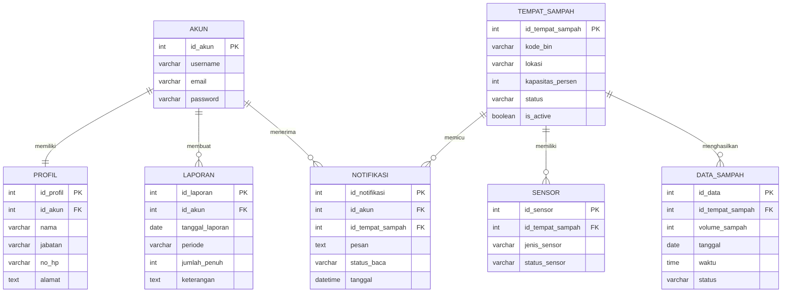

# ERD Sederhana SAMOSA

Versi ini dibuat lebih sederhana agar mirip dengan contoh diagram relasi tabel pada laporan.

## Entitas

1. `akun`
2. `profil`
3. `tempat_sampah`
4. `sensor`
5. `data_sampah`
6. `notifikasi`
7. `laporan`

## Relasi

1. `akun` 1:1 `profil`
2. `akun` 1:N `laporan`
3. `akun` 1:N `notifikasi`
4. `tempat_sampah` 1:N `sensor`
5. `tempat_sampah` 1:N `data_sampah`
6. `tempat_sampah` 1:N `notifikasi`

## Mermaid

## Bentuk relasi untuk ditulis di laporan

- Tabel `akun` berelasi satu banding satu dengan tabel `profil`.
- Tabel `akun` berelasi satu banding banyak dengan tabel `laporan`.
- Tabel `akun` berelasi satu banding banyak dengan tabel `notifikasi`.
- Tabel `tempat_sampah` berelasi satu banding banyak dengan tabel `sensor`.
- Tabel `tempat_sampah` berelasi satu banding banyak dengan tabel `data_sampah`.
- Tabel `tempat_sampah` berelasi satu banding banyak dengan tabel `notifikasi`.
